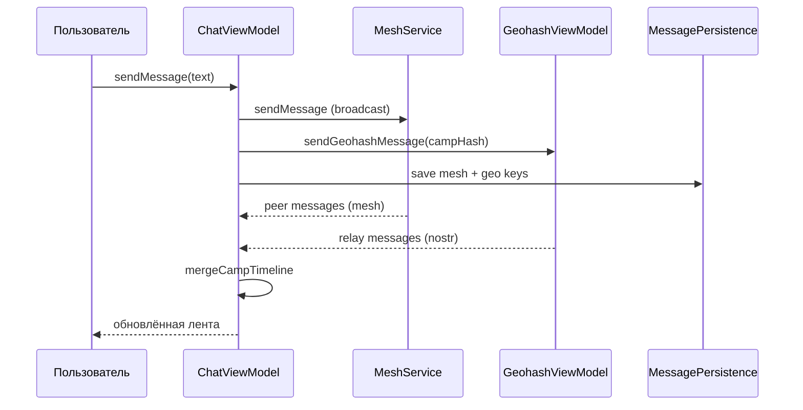

# Техническая документация — Neon / Bitchat Android (ветка `feat/messenger-roles-geolocation`)

Документ описывает все доработки под сценарий **лагерного мессенджера**: офлайн-чаты через Bluetooth mesh, роли, карта, персистентность, UI и **единый групповой чат лагеря** (аналог Telegram-группы на территории всего лагеря).

**Пакет приложения:** `com.neon.android`  
**Application ID:** `info.nlogn.chat`  
**Репозиторий:** https://github.com/alezhg1/bitchat-android  
**Рабочая ветка:** `feat/messenger-roles-geolocation`

---

## 1. Краткое резюме для оператора

| Что | Как работает |
|-----|----------------|
| **Группа лагеря** | Один общий чат для всех на территории лагеря. Сообщения идут по **BLE mesh** (без интернета) и дублируются в **Nostr geohash**-комнату (если есть сеть). |
| **Именованные каналы** | Локальные «тематические» чаты через mesh (`#канал`), видны только участникам mesh. |
| **Личные чаты** | Шифрованный обмен (Noise / Nostr DM) с конкретным участником. |
| **Роли** | Ученик — без ключа. Учитель и админ — секретный ключ при входе. Карта — только учитель/админ. |
| **Координаты лагеря** | Задаются в `app/src/main/assets/camp_config.json` (рекомендуется для продакшена). |

---

## 2. Групповой чат лагеря (Camp Chat)

### 2.1. Что значит «по гео» и почему это не «выбор региона в UI»

В исходном Bitchat **геолокационные каналы** — это подписка на Nostr-relay по **geohash** (ячейка на карте мира). Точность geohash задаёт размер «комнаты»:

| Precision | Уровень | Примерный размер ячейки |
|-----------|---------|-------------------------|
| 4 | Province | ~39 км |
| 5 | City | ~4,9 км |
| **6** | **Neighborhood** | **~1,2 км** |
| 7 | Block | ~153 м |

Для лагеря выбран **precision 6**: одна ячейка покрывает типичную территорию лагеря (несколько корпусов, поля, столовая). Это **не** интерфейс «выбери город/район» — пользователь видит один чат **«Лагерь»**, а geohash используется как **технический идентификатор комнаты** для Nostr и слияния истории.

### 2.2. Гибридная доставка (как Telegram, но офлайн-first)

```
┌─────────────┐     BLE mesh broadcast      ┌─────────────┐
│  Устройство │ ──────────────────────────► │  Устройство │
│      A      │     (multi-hop по лагерю)   │      B      │
└──────┬──────┘                             └─────────────┘
       │
       │  Nostr geohash event (если есть интернет/Tor)
       ▼
┌─────────────┐
│ Nostr relay │
└─────────────┘
```

- **Офлайн:** сообщения распространяются по **Bluetooth LE mesh** (broadcast, multi-hop через `MeshForegroundService`).
- **Онлайн:** то же сообщение публикуется в **Nostr** в geohash-комнату лагеря (`geo:{campHash}`).
- **UI:** лента = объединение mesh-сообщений (`messages`) и geo-сообщений (`geo:{hash}`) без дубликатов по `message.id`.

### 2.3. Конфигурация лагеря

Файл: `app/src/main/assets/camp_config.json`

```json
{
  "name": "Лагерь",
  "latitude": 55.751244,
  "longitude": 37.618423,
  "precision": 6,
  "autoCaptureFromGps": true
}
```

| Поле | Описание |
|------|----------|
| `name` | Отображаемое имя группы в UI |
| `latitude` / `longitude` | Фиксированные координаты **центра лагеря**. Если оба `0.0` — якорь берётся с **первого GPS-fix** на устройстве |
| `precision` | Длина geohash (по умолчанию 6) |
| `autoCaptureFromGps` | Разрешить захват якоря с GPS, если координаты в конфиге нулевые |

**Важно для продакшена:** задайте **одинаковые** `latitude`/`longitude` во всех сборках APK лагеря. Иначе при `autoCaptureFromGps` у разных устройств могут получиться **разные** geohash и Nostr-история не сойдётся (mesh при этом всё равно работает).

Geohash сохраняется в SharedPreferences (`camp_chat` / `camp_geohash`) после первого успешного `ensureCampAnchor()`.

### 2.4. Ключевые классы

| Класс | Назначение |
|-------|------------|
| `CampChatManager` | Конфиг, якорь geohash, выбор camp-канала, слияние ленты |
| `LocationChannelManager` | Выбор активного канала (Mesh / Location) |
| `LocationSharingService` | Периодическая рассылка позиции по mesh (`[GEOLOC]:…`) |
| `ChatViewModel.switchToCampChat()` | Переключение в режим лагеря, join `#лагерь` |
| `ChatViewModel.sendMessage()` | При camp mode: mesh + Nostr + двойное сохранение |
| `ChatsListSheet` | Список чатов: **Лагерь** / каналы / личные |

Константа mesh-тега: `CampChatManager.CAMP_MESH_CHANNEL = "#лагерь"`.

### 2.5. Жизненный цикл

1. `MainActivity` → после разрешений вызывается `ChatViewModel.onAppReady()`.
2. `CampChatManager.ensureCampAnchor()` — из конфига или GPS.
3. `switchToCampChat()` — `LocationChannelManager.select(Location)` + join `#лагерь`.
4. При обновлении GPS: `LocationChannelManager.computeChannels()` → `CampChatManager.onLocationUpdate()` (автовыбор camp, если был Mesh).
5. Отправка сообщения в camp mode: `meshService.sendMessage()` + `geohashViewModel.sendGeohashMessage()`.

---

## 3. Типы чатов и хранение

| Тип | Ключ хранения | Транспорт | Без интернета |
|-----|---------------|-----------|---------------|
| **Лагерь (camp)** | `messages` + `geo:{campHash}` | Mesh + Nostr | Mesh — да |
| **Канал `#name`** | `channelMessages["#name"]` | Mesh broadcast | Да |
| **Личный** | `privateChats[peerId]` | MessageRouter (Noise / Nostr DM) | Частично |
| **Расширенные geo-каналы** | `geo:{geohash}` | Только Nostr | Нет |

Персистентность: `MessagePersistenceService` загружает историю при старте (`loadAllIntoAppState()`).

---

## 4. Роли и аутентификация

### 4.1. Роли

| Роль | Ключ | Возможности |
|------|------|-------------|
| `STUDENT` | не требуется | Чаты, mesh, отправка geo-пакетов |
| `TEACHER` | секретный ключ | + офлайн-карта участников |
| `ADMIN` | секретный ключ | + карта, полный доступ оператора |

### 4.2. Реализация

- `RoleKeyManager` — проверка SHA-256 хешей ключей (plaintext **не** в репозитории).
- `LoginScreen` — поле секретного ключа для учителя/админа.
- `UserProfileManager` — статический ID (`staticId`), ФИО, роль, `clearAccount()` при выходе.
- Генерация новых ключей: `tools/generate_role_keys.ps1`.

### 4.3. Выход из аккаунта

`AboutSheet` → «Выйти из аккаунта» → `MainActivity.performLogout()` → `ChatViewModel.logout()`:

- очистка профиля, grant роли, nickname;
- остановка `LocationSharingService`;
- очистка in-memory чатов и persisted messages;
- сброс `appReady` для повторного onboarding.

---

## 5. Геолокация и карта

### 5.1. Протокол GEOLOC (mesh)

Каждые **15 минут** (настраивается в сервисе) устройство рассылает broadcast:

```
[GEOLOC]:{staticId}|{fio}|{lat}|{lon}|{ROLE}|{timestampMs}
```

Получатели с ролью TEACHER/ADMIN видят точки на **офлайн-карте** (`MapScreen`).

### 5.2. LocationSharingService

- GPS + кэш последней позиции.
- Привязка к `MeshService` и scope ViewModel.
- Старт в `onAppReady()`, стоп при `logout()`.

### 5.3. MapScreen

- Canvas-карта без тайлов (офлайн).
- Доступ: только `UserRole.TEACHER` и `UserRole.ADMIN`.

---

## 6. Исправления onboarding и разрешений

### Проблема

Краш после выдачи разрешения на геолокацию из-за ранней регистрации глобальных receiver'ов Bluetooth/Location.

### Решение

- `LocationStatusManager` — мониторинг только на шагах `LOCATION_CHECK` / `BLUETOOTH_CHECK`.
- `MainActivity` — guards в `handleLocationEnabled` / `handleBluetoothEnabled`.
- `OnboardingCoordinator` — отложенный переход к background location.

---

## 7. UI мессенджера

| Компонент | Изменения |
|-----------|-----------|
| `Typography.kt` | Sans-serif вместо monospace |
| `MessageComponents.kt` | Пузыри, имя отправителя, время внутри bubble |
| `ChatHeader.kt` | Аватар, заголовок ФИО, subtitle для лагеря/канала |
| `ChatsListSheet.kt` | Список: Лагерь / каналы / личные; ссылка «Расширенные локационные каналы…» |
| `InputComponents.kt` | Строка ввода в стиле мессенджера |
| `ChatColors.kt`, `ChatAvatar` | Единая палитра и аватары по инициалам |

Терминология в UI: **«Чаты»** вместо mesh/channels где применимо.

---

## 8. Архитектура (слои)

```
ui/           — Compose экраны, ViewModels
service/      — MeshForegroundService
mesh/         — BLE discovery, routing
geohash/      — Camp chat, location channels, sharing
identity/     — Профиль, роли, ключи
nostr/        — Relay, geohash events, DM
services/     — MessagePersistenceService
crypto/ noise/ — Шифрование каналов
```

Паттерн: **MVVM**, `ChatViewModel` делегирует в `*Manager` (channel, private, message, data).

---

## 9. Сборка и деплой

```bash
./gradlew assembleDebug    # debug APK
./gradlew test               # unit tests
./gradlew lint               # lint
```

### Чеклист перед выездом в лагерь

1. Установить **реальные координаты** в `camp_config.json`.
2. Раздать APK с одной ветки (`feat/messenger-roles-geolocation`).
3. Выдать ключи учителям/админам (хранить offline).
4. Проверить Bluetooth + Location на всех устройствах.
5. Убедиться, что `MeshForegroundService` не убивается системой (уведомление foreground).

---

## 10. Известные ограничения

- **Nostr** требует сеть; без неё работает только mesh-часть лагеря.
- **Разные geohash** при GPS-capture на разных устройствах — используйте фиксированный конфиг.
- **BLE range** — сообщения multi-hop, но плотность устройств влияет на доставку.
- **Расширенные локационные каналы** (старый geohash picker) — только Nostr, для продвинутых сценариев, не основной UX лагеря.

---

## 11. Карта изменённых файлов (основное)

```
app/src/main/assets/camp_config.json          — NEW
app/src/main/java/com/neon/android/geohash/CampChatManager.kt — NEW
app/src/main/java/com/neon/android/geohash/LocationChannelManager.kt
app/src/main/java/com/neon/android/geohash/LocationSharingService.kt
app/src/main/java/com/neon/android/identity/RoleKeyManager.kt
app/src/main/java/com/neon/android/identity/UserProfileManager.kt
app/src/main/java/com/neon/android/onboarding/LoginScreen.kt
app/src/main/java/com/neon/android/onboarding/LocationStatusManager.kt
app/src/main/java/com/neon/android/onboarding/OnboardingCoordinator.kt
app/src/main/java/com/neon/android/MainActivity.kt
app/src/main/java/com/neon/android/services/MessagePersistenceService.kt
app/src/main/java/com/neon/android/ui/ChatViewModel.kt
app/src/main/java/com/neon/android/ui/ChatScreen.kt
app/src/main/java/com/neon/android/ui/ChatsListSheet.kt
app/src/main/java/com/neon/android/ui/ChatHeader.kt
app/src/main/java/com/neon/android/ui/MessageComponents.kt
app/src/main/java/com/neon/android/ui/InputComponents.kt
app/src/main/java/com/neon/android/ui/AboutSheet.kt
app/src/main/java/com/neon/android/ui/theme/*
docs/TECHDOC_RU.md                            — этот документ
tools/generate_role_keys.ps1
```

---

## 12. Диаграмма потока сообщения (лагерь)



---

*Документ актуален для ветки `feat/messenger-roles-geolocation`. При мерже в main обновите версию и changelog.*
